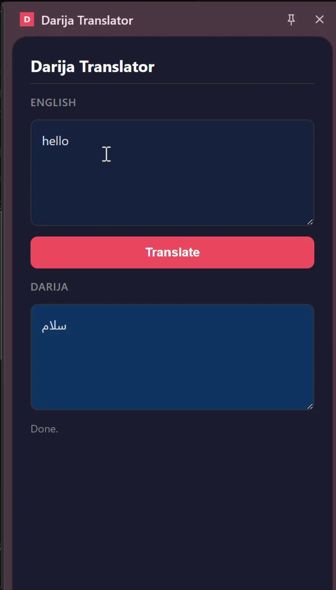

# Darija Translator

A REST API that translates English into Moroccan Darija using GPT-4o-mini. I built this for a distributed systems course — the actual goal was to practice multi-client architecture, the translation part was just a good excuse.

The backend is Jakarta EE (JAX-RS) deployed on WildFly. Five different clients all hit the same endpoint: a Chrome extension with a side panel, a React Native app, a PHP web UI, a Python script, and cURL.


---

## How it works

Every request goes through two layers before hitting the translation logic:

1. A servlet filter (`@WebFilter`) adds CORS headers and kills OPTIONS preflights early — this has to happen at the servlet layer, before JAX-RS, otherwise browser preflight requests never complete
2. A JAX-RS `ContainerRequestFilter` checks for a valid Bearer token — no token, no translation

After that, `TranslateResource` takes the text, builds a prompt, calls the OpenAI API using Java's built-in `HttpClient`, parses the response with Jakarta JSON-P, and returns the Darija translation.

---

## Stack

Backend is Java 17 + Jakarta REST on WildFly 39, built with Maven. LLM is GPT-4o-mini. Clients are Chrome (Manifest V3), React Native, Python, and PHP.

---

## Running it locally

You need Java 17, Maven, and WildFly 39.

```bash
export OPENAI_API_KEY=your-key
export API_TOKEN=your-token

cd darija-translator
mvn clean package
cp target/darija-translator.war $WILDFLY_HOME/standalone/deployments/
$WILDFLY_HOME/bin/standalone.sh
```

Test it:

```bash
curl -X POST http://localhost:8080/darija-translator/api/translate \
  -H "Content-Type: application/json" \
  -H "Authorization: Bearer your-token" \
  -d '{"text": "How are you?"}'
```

Returns `{"translation":"كيداير؟"}` if everything is running.

For the Chrome extension: go to `chrome://extensions/`, enable developer mode, load unpacked, point it at the `darija-chrome-extension/` folder. Then highlight any text on a page, right-click, and hit "Translate to Darija".

Python client: `pip install requests` then run `python python-client/translator_client.py`.

PHP client: `cd php-client && php -S localhost:8000`.

---

## Structure

```
darija-translator/src/main/java/ma/aui/cs/
├── RestApplication.java      # sets /api as the base path
├── TranslateResource.java    # POST /api/translate
├── AuthFilter.java           # bearer token check
└── CorsServletFilter.java    # cors + preflight handling

darija-chrome-extension/      # manifest v3 side panel + context menu
react-native-app/
python-client/
php-client/
```

---


---

Built for CSC3374 — Advanced Distributed Programming Paradigms, Al Akhawayn University in Ifrane.
